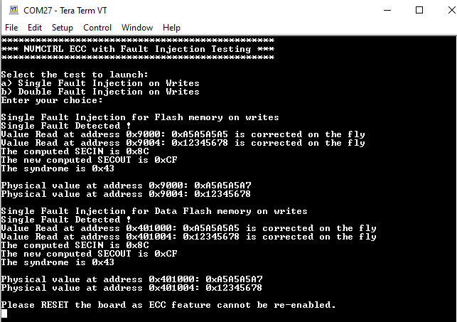

# NVMCTRL ECC Testing

This example application demonstrates how to test the NVMCTRL ECC feature on internal Flash and Data Flash memories.

## Description

This example uses the NVMCTRL peripheral library to test its ECC with Fault Injection feature. This application write 64-bit data in Flash and Data Flash for single-error injection, and 64-bit data in Flash for double-error injection to highlights SEC and DED process.

## Downloading and building the application

To clone or download this application from Github, go to the [main page of this repository](https://github.com/Microchip-MPLAB-Harmony/csp_apps_pic32cm_jh01) and then click **Clone** button to clone this repository or download as zip file.
This content can also be downloaded using content manager by following these [instructions](https://github.com/Microchip-MPLAB-Harmony/contentmanager/wiki).

Path of the application within the repository is **apps/nvmctrl/nvmctrl_ecc_testing/firmware** .

To build the application, refer to the following table and open the project using its IDE.

| Project Name      | Description                                    |
| ----------------- | ---------------------------------------------- |
| pic32cm_jh01_curiosity_pro.X | MPLABX project for [PIC32CM JH01 Curiosity Pro Evaluation Kit](https://www.microchip.com/developmenttools/ProductDetails/) |
|||

## Setting up the hardware

The following table shows the target hardware for the application projects.

| Project Name| Board|
|:---------|:---------:|
| pic32cm_jh01_curiosity_pro.X | [PIC32CM JH01 Curiosity Pro Evaluation Kit](https://www.microchip.com/developmenttools/ProductDetails/)
|||

### Setting up [PIC32CM JH01 Curiosity Pro Evaluation Kit](https://www.microchip.com/developmenttools/ProductDetails/)

- Connect the Debug USB port on the board to the computer using a micro USB cable

## Running the Application

1. Build and Program the application using its IDE
2. Menu is displayed with following choices
	- 'a': Single Fault Injection is chosen and following message is displayed on console:
	
	
	
	- 'b': Double Fault Injection is chosen and following message is displayed on console:
	
	
